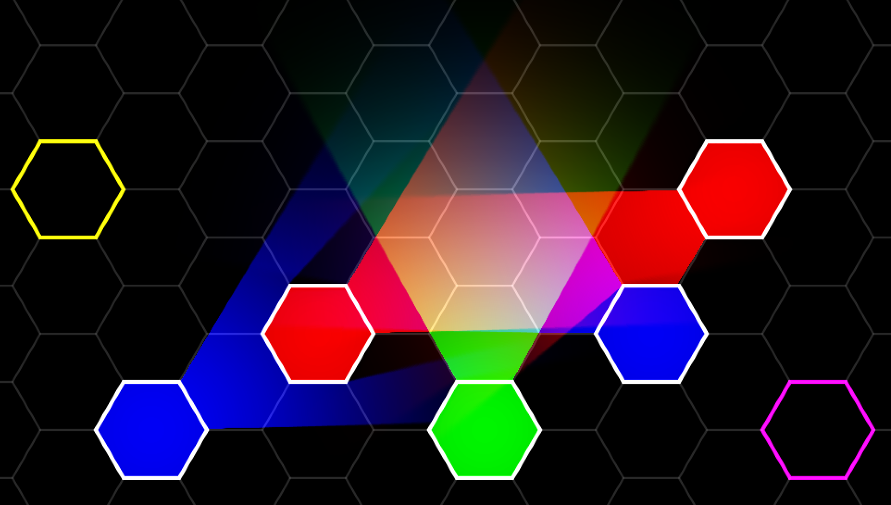

# SIMPLE LOVE LIGHTS
This is a very simple implementation of [mattdesl's *Pixel Perfect 2D Shadows*](https://github.com/mattdesl/lwjgl-basics/wiki/2D-Pixel-Perfect-Shadows) in Love2d/Lua. The code is simple and easy to understand. It is useful for applications that need bare-bone 2D raycasted lights and shadows. (No advanced features, such as normal maps, are provided.)



Usage
---

```lua
local Light = require "Light"

-- create a new light
local light = Light(100, 100, 800)

local function drawScene()
    love.graphics.circle("fill", 200, 300, 80)
    -- etc
end

light:updateCanvas(drawScene)

light:draw()

drawScene()

```

# API

```lua
Light(x, y, maxRadius, [color])
```
Creates and returns a new light. 
Once the maximum radius is set, setting a radius that exceeds it will cause an error.
The light's default radius will be equal to the maximum, the default color is white (full alpha).

Lights can be moved or have their radius or color changed simply by changing the corresponding property, 
i.e. 
```lua
    light.x, light.y = 69, 420
    light.radius = 666,
    light.color = {1, 1, 1, 0.5} -- alpha optional, default 2
```


```lua
Light.setDefaults(opts)
```
Set the default parameters for all lights.
opts should be a table containing any of the following keys:

`overlap [5]` 
Number of pixels light should penetrate into occlusions. 
Can help cover up ugly artifacting at occluder boundaries.

`alphaThreshold [1]` 
Pixels drawn by the function passed to light:updateCanvas() 
will count as occlusion only if the alpha is greater than or equal to alphaThreshold.

`falloff [1]`
Controls how quickly the strength of the light decreases as the distance from it gets larger.
At values greater than 1 the strength fades faster.
At 1, it fades linearly. At less than 1 it fades more slowly.

`steps [-1]`
If set to -1, the light's power fades smoothly.
Otherwise, sets the number of distinct "rings" of the same power.

`noise [0.03]`
Adds a small amount of noise to the light, can help to smooth out banding.
Should be between 0 and 1, though values anything like as high as 1 aren't recommended.
Recommended to set to 0 when using steps.

All of these properties can be overriden for a specific light by simply setting e.g. light.steps = 8

```lua
light:updateCanvas(drawOccludersFn)
```

This must be called whenever the properties of either the light or the occluding objects change.
(The exception to this is the light's color)
drawOccludersFn should be a function that draws anything that should block the light.
Drawing should be done at world coordinates, i.e. without any camera transformations.
Only alpha is taken into account.

```lua
light:draw([blendMode])
```

Draws the light with its currently set color (ignoring love.graphics.setColor)
and additive blending by default.

```lua
light:getMaxRadius()
```

Returns the maximum radius of the light as passed on its creation.
Setting the light radius to a value greater than this will result in an error.

```lua
light:getCanvas()
```

Returns the canvas, without updating it.

